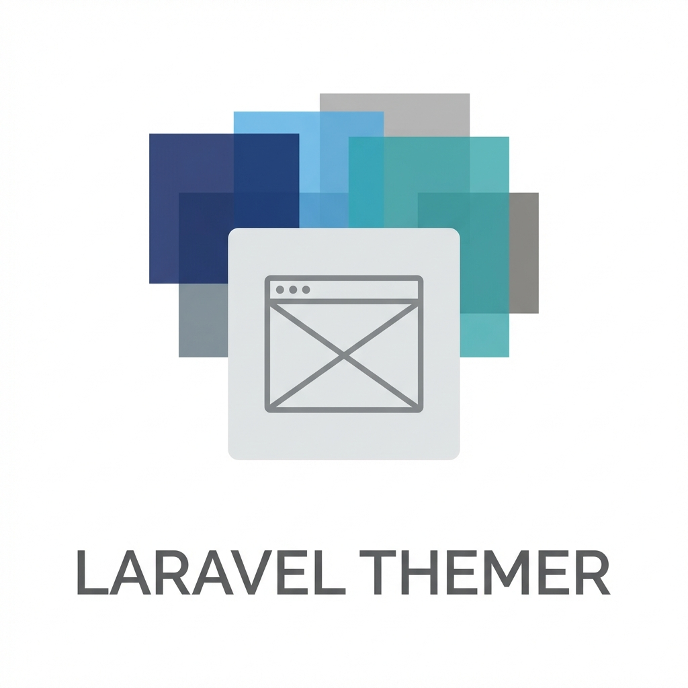

# Laravel Themer 🎨



[](https://packagist.org/packages/alizharb/laravel-themer)
[](https://github.com/alizharb/laravel-themer/actions?query=workflow%3ATests+branch%3Amain)
[](https://github.com/alizharb/laravel-themer/actions?query=workflow%3APHPStan+branch%3Amain)
[](https://packagist.org/packages/alizharb/laravel-themer)
[](https://packagist.org/packages/alizharb/laravel-themer)

**Laravel Themer** is a robust, enterprise-grade theme management package for Laravel applications. It provides a seamless way to manage themes, including asset publishing, view overrides, Livewire 4 integration, and modular support. Designed for modern TALL stack applications, it simplifies the creation of multi-themed applications without the complexity.

## ✨ Features

- 🎭 **Theme Management**: Create, activate, and manage themes effortlessly with full multi-level inheritance support.
- 🚀 **Zero-IO Discovery**: High-performance architecture that eliminates filesystem scans in production via deep caching.
- ⚡ **Livewire 4 Integration**: First-class support for Livewire components and layouts with theme-aware resolution.
- 🎨 **View Overrides**: Intelligent view resolution cascading from Active Theme -> Parent Theme -> Application.
- 🚀 **Auto-Blade Discovery**: Automatic registration of theme-specific Blade components and inheritance.
- 🏷️ **Theme Versioning**: Support for version metadata in `theme.json` for easier dependency mapping.
- 🚦 **Ephemeral Switching**: Temporarily switch themes for specific tasks using `Themer::forTheme()`.
- 🛣️ **Route Middleware**: Enforce specific themes for routes or groups via `middleware('theme:name')`.
- 📦 **Asset Management**: Automatic asset publishing and symlinking mechanism for theme assets.
- 🧩 **Modular Support**: Native integration with `laravel-modular` including dependency verification in `theme:check`.
- 🛡️ **Hierarchy Guard**: Built-in validation to detect circular dependencies, missing parents, and required modules.
- 🔧 **Artisan Commands**: A comprehensive suite of commands (`make`, `list`, `check`, `cache`, `debug`) to manage themes.
- 🛠 **Refined Vite Support**: Flexible Vite integration that supports theme-specific manifests and custom build directories.坐

## 📚 Documentation

For full documentation, please visit [**alizharb.github.io/laravel-themer**](https://alizharb.github.io/laravel-themer) or browse the [docs/](docs/) directory.

---

## 🚀 Installation

Install the package via Composer:

```bash
composer require alizharb/laravel-themer
```

Publish the configuration file:

```bash
php artisan vendor:publish --tag="themer-config"
```

---

## 📖 Usage

### Creating a Module

Generate a new theme with a standard directory structure:

```bash
php artisan theme:make "Dark Theme"
```

### Activating a Theme

Switch the active theme globally:

```bash
php artisan theme:activate "Dark Theme"
```

### Livewire Integration

The package automatically registers Livewire components within your theme.

```bash
php artisan make:livewire Header --theme="Dark Theme"
```

---

## 🧪 Testing

We strictly enforce testing. Use the provided test suite to verify your themes:

```bash
vendor/bin/pest
```

---

## 💖 Sponsors

We would like to extend our thanks to the following sponsors for funding Laravel Themer development. If you are interested in becoming a sponsor, please visit the [Laravel Themer GitHub Sponsors page](https://github.com/sponsors/alizharb).

---

## 🤝 Contributing

We welcome contributions! Please see [CONTRIBUTING](.github/CONTRIBUTING.md) for details.

1. Fork the Project
2. Create your Feature Branch (`git checkout -b feature/AmazingFeature`)
3. Commit your Changes (`git commit -m 'Add some AmazingFeature'`)
4. Push to the Branch (`git push origin feature/AmazingFeature`)
5. Open a Pull Request

---

## 🌟 Acknowledgments

- **Laravel**: For creating the most elegant PHP framework.
- **Spatie**: For setting the standard on Laravel package development.

---

## 🔒 Security

If you discover any security-related issues, please email **Ali Harb** at [harbzali@gmail.com](mailto:harbzali@gmail.com).

## 📄 License

The MIT License (MIT). Please see [License File](LICENSE.md) for more information.

---

<p align="center">
    Made with ❤️ by <strong>Ali Harb</strong>
</p>
